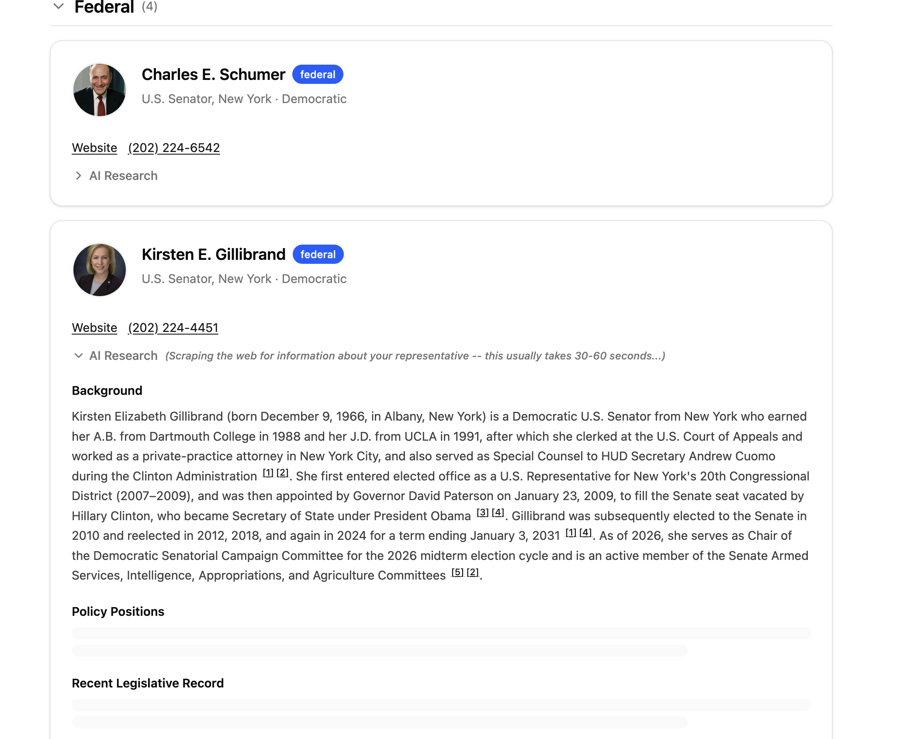

# MyReps — Design Approach

This document captures the design thinking, tradeoffs, and open challenges behind MyReps. It's a living document — update it as the product evolves.

For the product vision and principles that inform these decisions, see [MISSION.md](./MISSION.md).

## Overall Design

### Representatives
1. User enters their address.
2. Third-party APIs return a list of representatives at every level of government.
3. The user sees a card for each representative with basic info and a "Learn More" button.
4. When the user clicks "Learn More" on a specific rep, a research agent crawls the web to gather information about that representative.
5. Research results stream into the card section-by-section as each of 7 parallel agents completes, so the user sees content arriving incrementally rather than waiting for everything to finish.

Research is **on-demand** — only triggered for reps the user explicitly wants to learn about. This cuts API costs ~80%+ compared to researching every rep on every lookup, since most users only care about a few of their ~15+ representatives.

### Elections
1. User switches to the Elections tab (available after entering an address).
2. The backend calls the Google Civic Information API (`voterinfo` endpoint) with the user's address to discover upcoming elections, ballot contests, candidates, and voter info.
3. Up to 3 elections are automatically researched via the election research pipeline (2 sections: election context via sync LLM call + key issues/significance via web search agent).
4. Each election card shows AI-generated context, voter info (registration links, absentee info, early voting sites, drop-off locations), and ballot contests with candidates.
5. Candidates can be individually researched using the same on-demand representative research pipeline.

The election research pipeline is lighter than rep research — 2 sections vs 7, with only one requiring web search. Election research is cached per election+address combination.

## Summary Card Content

Agentic coding via Claude Code makes the technical aspects of building the functionality quite smooth. The true challenge of this project lies in the design of the product itself — specifically, crafting the content of the summary cards. For now, we are more focused on optimizing this content than the visual UI components such as color, font, etc.

The content in these cards is ultimately determined by the prompts given to the [research agent](../backend/research/pipeline.py) and the Pydantic models used to structure the data.

### Challenges

Crafting these cards is not easy. We need to strike several difficult balances:

- **Comprehensive information vs. conciseness** — give people enough to be useful without overwhelming them.
- **No PR spin, but still nonpartisan** — cut through talking points and present substance, without editorializing or taking sides.
- **Government speak vs. real-world impact** — translate policy language into plain terms so people can understand what actually affects them.

### Current Card Sections

| Section | Description | Format |
|---------|-------------|--------|
| **Background** | Who the representative is — career history, how they came into office, and relevant personal context. | Paragraph-style text, no bullets/lists |
| **Policy Positions** | Where the representative stands on key issues, based on their voting record and public statements rather than campaign messaging. | Paragraph-style text, no bullets/lists |
| **Recent Legislative Record** | Key legislative measures they recently supported or opposed. | Bulleted list |
| **Accomplishments** | Notable achievements, successful initiatives, awards, and bipartisan wins. | Bulleted list |
| **Controversies** | Scandals, ethics complaints, controversial votes or statements, lawsuits, and public criticism. | Bulleted list |
| **Other Recent Press** | Any other recent press about the representatives--public statements, local news coverage, etc. | Bulleted list |
| **Top Donors** | List of the representative's largest political donors, five max. | Bulleted list |

### Election Card Sections

Election research uses a lighter 2-section pipeline:

| Section | Description | Format |
|---------|-------------|--------|
| **Election Context** | What this election is and why it matters — explains the office, jurisdiction, and political context. Generated from LLM training data (no web search). | Paragraph-style text |
| **Key Issues & Significance** | Current political issues and significance of this specific election, researched via web search. | Paragraph-style text with citations |
